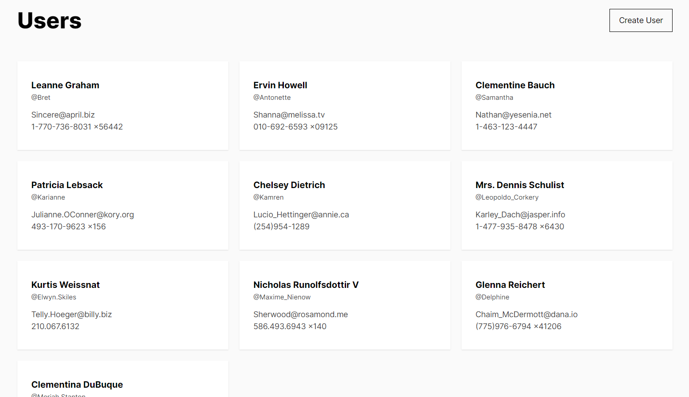

<div align="center">

# UsersApi

✨ Interaction with user data ✨

</div>

</br>
<div align="center">
  
</div>
</br>

## About UsersApi 📰

The UersApi repository serves as an exemplary solution for illustrating user data management concepts. It showcases the implementation of user creation, display, and validation functionalities, as well as the adaptability to different screens. While not intended for production use, this repository provides a solid foundation for understanding and implementing similar features in your own applications. By examining the code and structure of the UersApi repository, developers can gain insights into best practices and patterns for managing user data effectively.

### Installation and startup stages
```
npm install
```
```
npm run dev
```

### Additional commands
```
npm run build
```
```
npm run lint
```


### Deployment
This application can be used on Vercel - users-api-tau.vercel.app

### License
This project uses the MIT License, which is an open-source license that allows for the use, copy, modification, merge, publish, distribute, and sell copies of the software and/or modified versions. The license also provides no warranties and a disclaimer of liability from the authors of the software.

For more detailed information about the MIT License, please refer to the LICENSE file, which is located in the root of this project.
